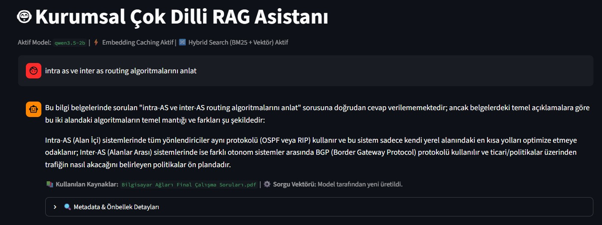
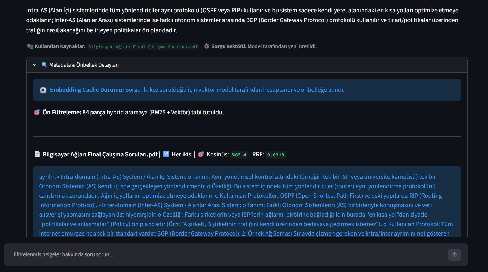
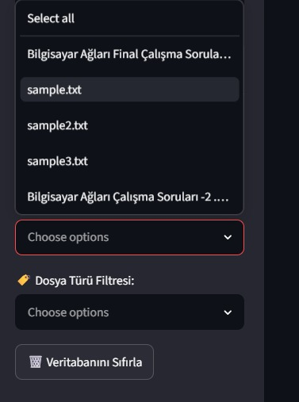
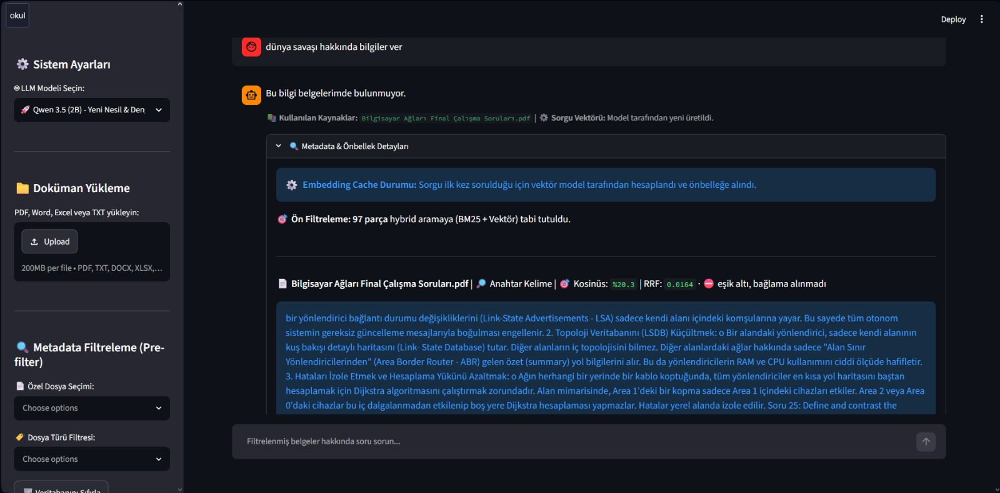

# Local RAG Assistant (Yerel RAG Asistanı)

[](https://www.python.org/)
[](https://streamlit.io/)
[](https://github.com/microsoft/foundry-local)
[](https://www.sqlite.org/fts5.html)

A document question-answering app (Retrieval-Augmented Generation) that runs **entirely on your own machine**. Your documents and questions are processed locally with models served by Microsoft's Foundry Local SDK (Qwen, Phi, DeepSeek); the models are downloaded once. Retrieval combines **SQLite FTS5 keyword search (BM25)** with **embedding search**, fused with Reciprocal Rank Fusion, and a confidence gate keeps weakly related text out of the model's context. The interface is in Turkish.

| Ask a question and see the sources | Look inside the retrieval |
|---|---|
|  |  |

## Features

- **Local processing:** text extraction, chunking, embeddings and generation all run on your machine through Foundry Local.
- **Hybrid search:** BM25 over an SQLite FTS5 index plus cosine similarity over embeddings, merged with Reciprocal Rank Fusion (RRF).
- **Confidence gate:** each retrieved chunk is checked individually; if nothing passes, the app answers with a fixed message and does not call the model.
- **Metadata pre-filtering:** restrict the search to chosen files or file types before ranking.
- **Five switchable models:** Qwen 2.5 (1.5B), Qwen 3.5 (2B), Phi-4 Mini, DeepSeek R1 (7B), Qwen2.5 Coder (1.5B).
- **Formats:** PDF, DOCX, XLSX/XLS, CSV and TXT.
- **Embedding cache:** query embeddings are cached for the session (up to 200 entries).
- **Hardware fallback:** if the GPU/NPU variant of a model cannot be downloaded or loaded, the app retries with the CPU variant.
- **Transparent results:** an expander shows, for every candidate chunk, how it was found (semantic, keyword or both), its cosine score, its RRF score and whether it passed the gate.



## How it works

1. **Ingestion:** text is extracted per file type and split into chunks of about 300 words with a 50-word overlap. Chunks are embedded with `qwen3-embedding-0.6b` and stored in SQLite (`documents` table, embeddings as JSON) together with an FTS5 index (`unicode61`, diacritics removed).
2. **Retrieval:** after the optional metadata filter, the query is embedded (or taken from the cache). Vector candidates are chunks with cosine ≥ 0.35 (up to 20); keyword candidates are the top 20 BM25 matches. The two ranked lists are fused with RRF (k = 60) and the **top 3 chunks** are kept.
3. **Gate:** a chunk enters the context if its cosine score is ≥ 0.38, or if it was also matched by keywords and its cosine score is ≥ 0.25. If no chunk passes, the answer is the fixed message "Bu bilgi belgelerimde bulunmuyor." ("This information is not in my documents.").
4. **Generation:** the context and the question go to the selected local model, which is instructed to answer only from the context. The stream is cut after 300 seconds or 6,000 characters to stop repetition loops.



## Quick start

Requirements: Python 3.10 or newer (the pinned versions were checked with Python 3.13).

```bash
git clone https://github.com/mBeratKeremAydin/yerel_rag_asistani.git
cd yerel_rag_asistani

python -m venv venv
# Windows:        .\venv\Scripts\activate
# macOS / Linux:  source venv/bin/activate

pip install -r requirements.txt
streamlit run gui.py
```

On the first run the app downloads the models it needs through Foundry Local (the embedding model `qwen3-embedding-0.6b` and the language model you select), which can take a while. Then upload documents in the sidebar, click the index button, and ask questions.

## Troubleshooting

- **Model download or hardware error:** check your connection and retry; the app falls back to a CPU variant when the GPU/NPU variant fails.
- **Foundry Local start-up error:** make sure the Foundry Local runtime/service is installed and running.
- **Excel/CSV not indexed:** `pip install -r requirements.txt` installs `openpyxl` and `tabulate`, which are needed for the conversion.

## Project structure

```text
yerel_rag_asistani/
├── gui.py              # Streamlit app: UI, ingestion, hybrid retrieval, generation
├── requirements.txt    # pinned dependencies
├── utils/              # command-line helpers: ingest.py, search.py, app.py (console chat), db_kontrol.py (lists indexed files)
├── docs/screenshots/   # images used in this README
├── data/               # your documents (created automatically, not tracked)
└── db/                 # SQLite database (created automatically, not tracked)
```

## Limitations

- Every query compares the query embedding with **all stored chunks in Python** (brute force), and embeddings are stored as JSON text, so it is meant for small to medium document sets.
- The thresholds (0.35, 0.38, 0.25), the chunk size and k = 60 were set by hand; there is no retrieval-quality evaluation.
- Small local models can still ignore the "answer only from the context" instruction.
- No automated tests; the helper scripts in `utils/` partly duplicate logic from `gui.py`.

## Türkçe özet

Tamamen yerel çalışan bir doküman soru-cevap (RAG) asistanı. Belgeleriniz ve sorularınız Foundry Local SDK ile sunulan yerel modellerle (Qwen, Phi, DeepSeek) işlenir. Arama, SQLite FTS5 anahtar kelime (BM25) ve gömme (embedding) vektörlerini RRF ile birleştirir; her parça için bir güven kapısı alakasız metnin modele ulaşmasını engeler. Dosya veya dosya türüne göre ön filtreleme, oturum boyunca sorgu vektörü önbelleği ve GPU/NPU yerine CPU'ya otomatik geçiş desteklenir. Arayüz Türkçedir. Kurulum için yukarıdaki *Quick start* bölümüne bakın.

## License

MIT, see [LICENSE](LICENSE).
